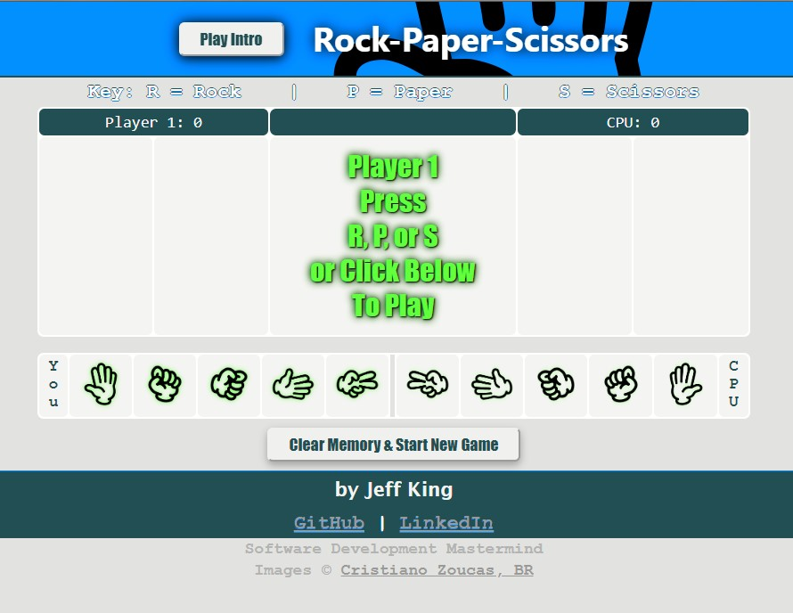
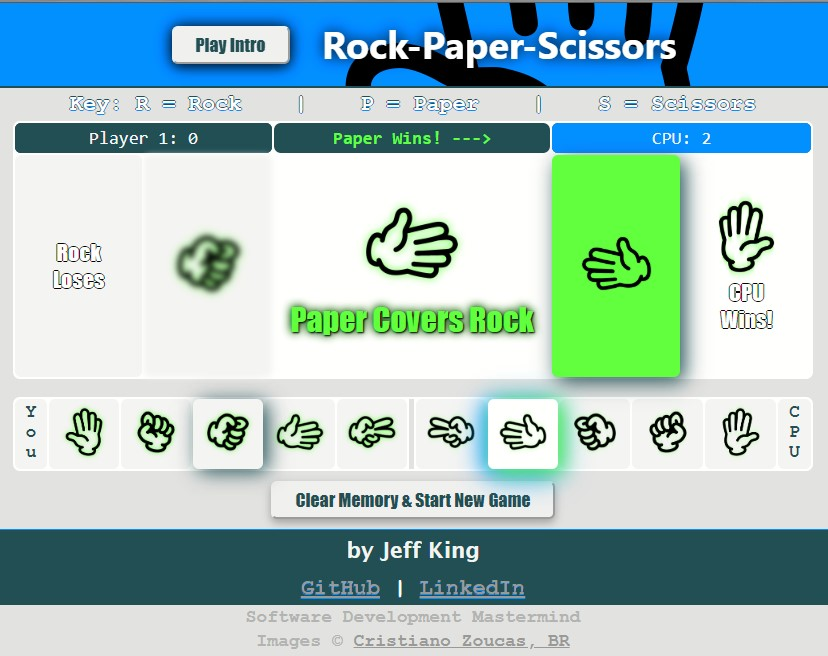

# JavaScript Rock-Paper-Scissors Game
Written entirely in pure JavaScript, HTML, and CSS, this game is a spin on the classic "Rock, Paper, Scissors" game we've all played.

## Links
[View Application](https://jazfunk.github.io/jk-rock-paper-scissors-game/)  
[View Repository](https://github.com/jazfunk/jk-rock-paper-scissors-game.git)

## Application Images

## Summary
Building this game was slightly challenging.  Although the intial logic to determine a winner was fairly simple, I spent a great deal of time experimenting with CSS styles, and making the UI elements dynamic in regards to game play.  While developing this game, I discovered how valuable CSS can be; used in conjunction with JavaScript, you can make your webpage stand out.

## Author
* **Jeff King** - *Full Stack Software Developer* - [GitHub](https://github.com/jazfunk) | [LinkedIn](https://www.linkedin.com/in/jeffking222/) | [Website](https://jeff-king.net)